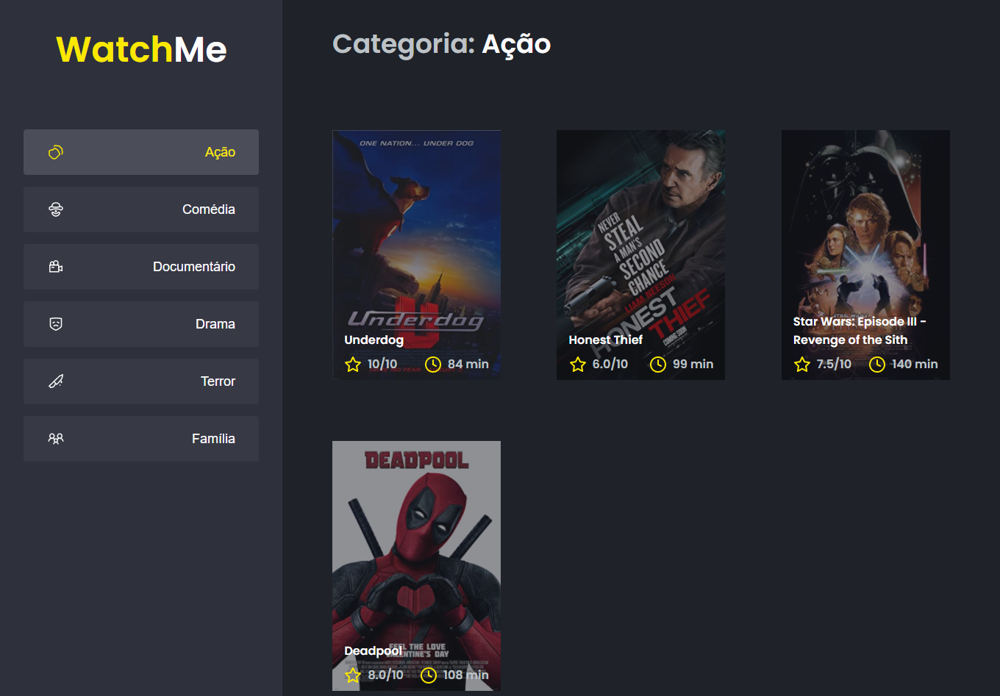

<div align="center">
    <h1>Watch Me</h1>
</div>

<p align="center">
  <a href="#-technologies">Technologies</a>&nbsp;&nbsp;&nbsp;|&nbsp;&nbsp;&nbsp;
  <a href="#-project">Project</a>&nbsp;&nbsp;&nbsp;|&nbsp;&nbsp;&nbsp;
  <a href="#-license">License</a>
</p>

<p align="center">
  
  
  

  
</p>

<br>

<div align="center">
  
</div>

---

## 🧪 Technologies

This project was developed using the following technologies:

-   [React JS](https://reactjs.org/)
-   [TypeScript](https://www.typescriptlang.org/)

## 🚀 Getting started

Clone the project and access the folder

```bash
$ git clone https://github.com/victortxc/challenge_2_watch_me.git && cd github_web
```

Follow the steps below

```bash
# Install the dependencies
$ npm install

# Start the project
$ npx json-server --watch server.json --port 3333
$ yarn dev
```

## 💻 Project

App to look for movies.

This is a project developed during the **[Ignite](https://rocketseat.com.br/ignite)**, presented by **[@Rocketseat](https://github.com/Rocketseat)**.

## 📝 License

This project is licensed under the MIT License. See the [LICENSE](LICENSE.md) file for details.
